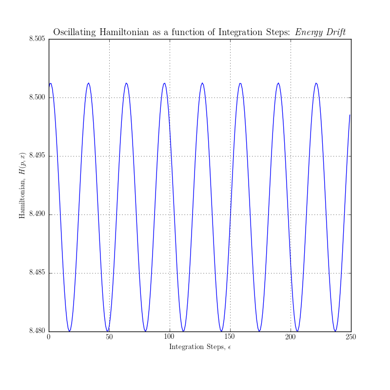
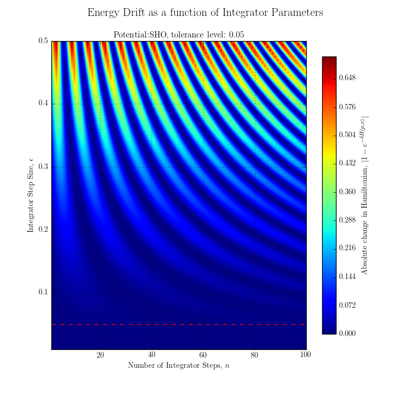

Hybrid Monte Carlo (HMC)
===============
This directory contains the HMC code and test cases.

## Table of Contents
 - [To Do](#td)
 - [Interesting Tests](#tests)
     * [Hamiltonian Dynamics (Leap-Frog)](#tests-hdlf)
	 * [Leap-Frog Parameters](#tests-lf)
 - [Code Acknowledgements](#ak)

<a name="td"/>
## To Do
 - ~~Hamiltonian Dynamics: Leap-Frog Integration~~
 - ~~Practical Test: Simple Harmonic Oscillator~~
 - ~~Unit Test: Energy Conservation~~
 - ~~Unit Test: Reversibility: Satisfy Detailed Balance~~
 - ~~HMC Sampler~~
 - Practical Test: Bivariate Gaussian
 - Practical Test: Simple Harmonic Oscillator
 - Practical Test: Quantum Harmonic Oscillator
   * n-dimensional
   * n-Dimensional, Anharmonic
 - *Code on GPU (if time) & Unit Test*
 - *Unit Test (if time): v. high-dim Gaussian*

<a name="tests"/>
## Interesting Tests

<a name="tests-hdlf"/>
### Hamiltonian Dynamics (Leap-Frog)
A basic demonstration of symplectic Leap-Frog integrator. The key points to note are the
conservation of energy shown by the circular phase space path and near stationary hamiltonian. The small oscillations are due to *energy drift* which can also be seen in the subtle deviation from a true circle in phase space. Importantly the circular phase path is a closed loop showing reversibility in artificial time.

Animated Summary | Energy Drift
:---:|:---:
  |  

<a name="tests-lf"/>
### Energy Drift for varying Leap-Frog Parameters
A contour plot showing the small energy loss encountered for different Leap-Frog parameters. Tested using the Simple Harmonic Oscillator. Acceptable tolerance level is
show as a dashed horizontal line.

	

<a name="ak"/>
## Code Acknowledgements
 - `matlab_HMC.m` is taken from [The Clever Machine](https://theclevermachine.wordpress.com/2012/11/18/mcmc-hamiltonian-monte-carlo-a-k-a-hybrid-monte-carlo/)
 - `theano_HMC.py` is taken from the DeepLearning.net [tutorial on HMC](http://deeplearning.net/tutorial/hmc.html)