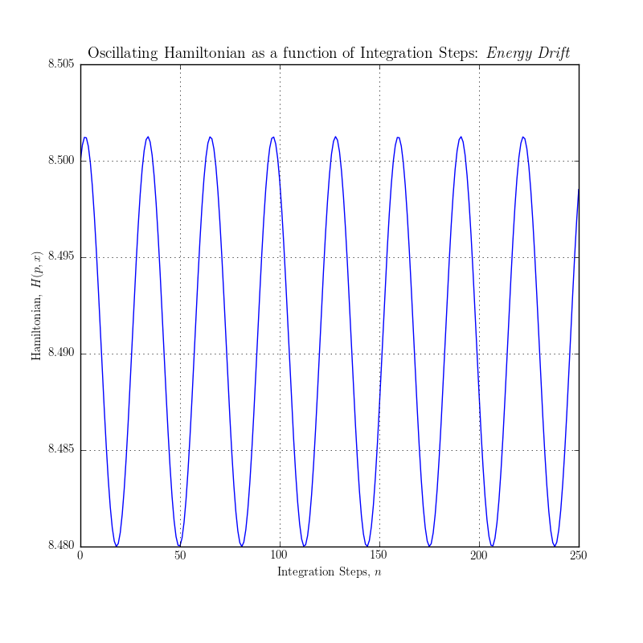
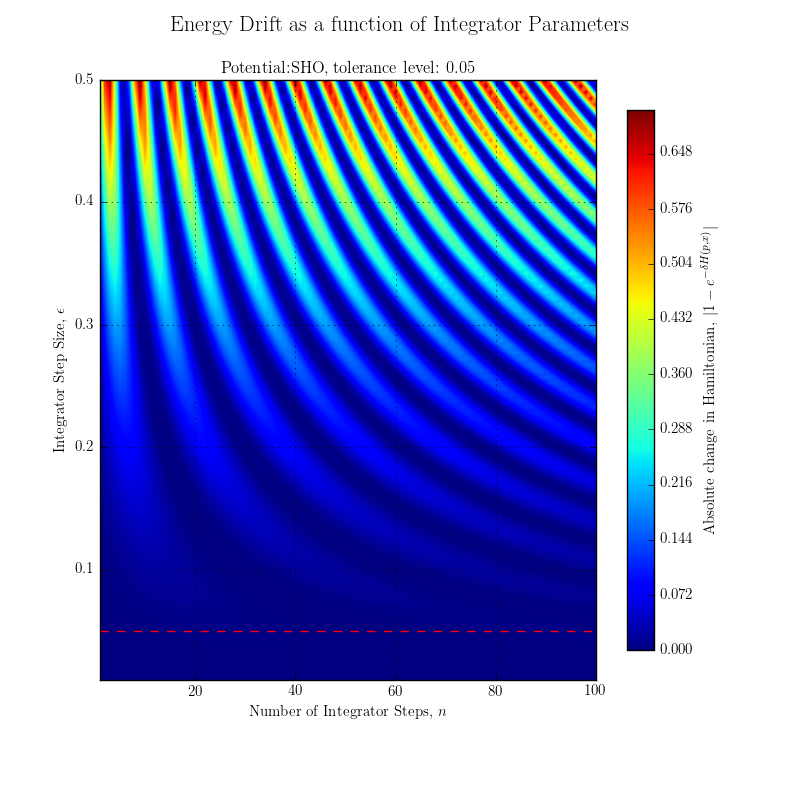
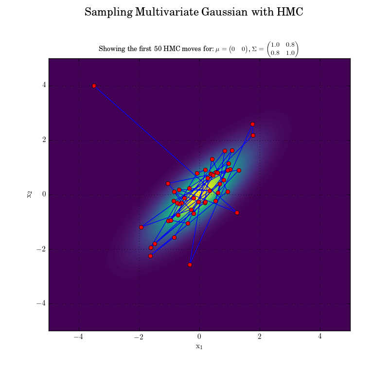

Hybrid Monte Carlo (HMC)
===============
This directory contains the HMC code and test cases.

# Table of Contents
 - [To Do](#td)
     * [1D Lattice Quantum Theory](#td-1d)
	 * [nD Lattice Quantum Field Theory](#td-nd)
 - [Interesting Tests](#tests)
     * [Hamiltonian Dynamics (Leap-Frog)](#tests-hdlf)
	 * [Leap-Frog Parameters](#tests-lf)
	 * [HMC sampling Bivariate Gaussian](#tests-bg)
 - [Code Acknowledgements](#ak)

<a name="td"/>
# To Do

<a name="td-1d"/>
## 1D Lattice Quantum Theory
### Implementation
 - ~~Hamiltonian Dynamics: Leap-Frog Integration~~
 - ~~Practical Test: Simple Harmonic Oscillator~~
 - ~~Unit Test: Energy Conservation~~
 - ~~Unit Test: Reversibility: Satisfy Detailed Balance~~
 - ~~HMC Sampler~~

### Results
 - ~~Unit Test: Simple Harmonic Oscillator (1D Gaussian)~~
 - ~~Unit Test: Bivariate Gaussian~~
 - ~~Plot: Sampled MVG Potential for 2D (easy gen. to nD)~~
 - ~~Plot: Sampled SHO Potential for 1D~~
 - Plot: Quantum Harmonic Oscillator Potential for 1D
 - Extend to Kramers condition on the Lattice

<a name="td-nd"/>
## nD Lattice Quantum Field Theory
### Implementation
 - ~~Gradient / Laplacian functions on the lattice~~
 - ~~Unit Test: Gradient / Laplacian vs. expected values~~
 - Potentials on the Lattice
 - ~~Leap Frog algorithm on the lattice (position and momentum updates)~~
 - Unit Test: Leap Frog moves on the lattice
 - HMC on the Lattice - minimal changes: all in Leap Frog
 - Unit Test: HMC on the Lattice
 - Extend to Kramers condition on the Lattice

### Results
 - Plot: Quantum Path for QHO
 - Plot: Sampled Quantum Harmonic Oscillator potential
 - Plot: Quantum Path for AHO
 - Plot: Quantum Anharmonic Oscillator potential (phi^4)

<a name="tests"/>
## Interesting Tests

<a name="tests-hdlf"/>
### Hamiltonian Dynamics (Leap-Frog)
A basic demonstration of symplectic Leap-Frog integrator. The key points to note are the
conservation of energy shown by the circular phase space path and near stationary hamiltonian. The small oscillations are due to *energy drift* which can also be seen in the subtle deviation from a true circle in phase space. Importantly the circular phase path is a closed loop showing reversibility in artificial time.

Animated Summary | Energy Drift
:---:|:---:
  |  

<a name="tests-lf"/>
### Energy Drift for varying Leap-Frog Parameters
A contour plot showing the small energy loss encountered for different Leap-Frog parameters. Tested using the Simple Harmonic Oscillator. Acceptable tolerance level is
show as a dashed horizontal line.

	

<a name="tests-bg"/>
### Sampling a Bivariate Gaussian
A demonstration of the first 50 HMC moves when sampling a bivariate gaussian distribution. Normally these moves would be part of the *burn in* phase. An interesting thing to note is that this is equivalent to a simple harmonic oscillator based in a point-like lattice (i.e. no lattice!) of two dimensions. The covariance matrix can be diagonalised and linearly decomposed into two separate oscillators and then they can be considered as two separated point oscillators.

	

<a name="ak"/>
## Code Acknowledgements
See `../ref_code` for code snippets I found useful: Always helpful to see existing implementations to guide new implementations.